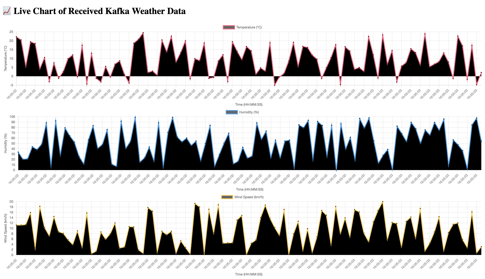
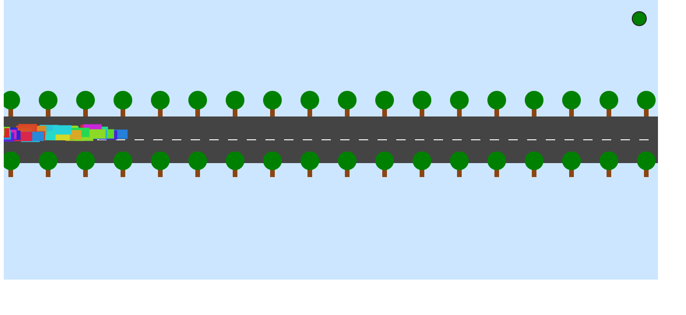
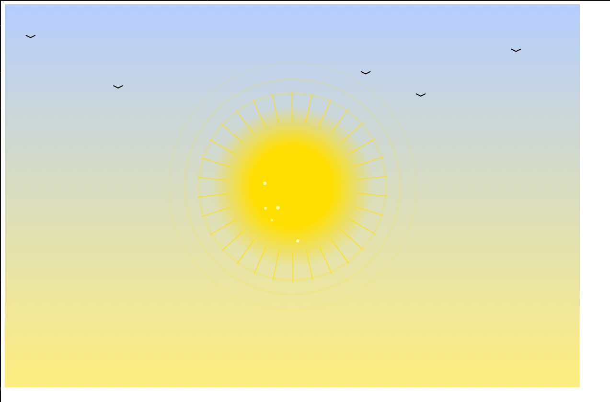

# Kafka Showcase

This project demonstrates how to set up a local Kafka cluster on **Minikube** using the **Strimzi Operator** and Helm, including a complete MQTT-to-Kafka data pipeline and an interactive showcase.

## 📌 Requirements

To run this demo environment, you need:

- A [**Minikube**](https://minikube.sigs.k8s.io/docs/start/) cluster with:
  - Minimum **4–6 GB RAM** (more is better for scaling)
  - At least **3 CPUs**
- [kubectl](https://kubernetes.io/docs/tasks/tools/)
- [make](https://www.gnu.org/software/make/)
- [Docker](https://docs.docker.com/get-docker/)
- [Helm](https://helm.sh/docs/intro/install/)
- Internet access

## ✅ Step-by-Step Setup Guide

This is an example of how to locally start the Kafka Showcase using the simplest setup. You can later switch to different cluster types or showcases as needed.

### 1. Start Minikube & Core Components

```bash
make minikube_start
make argocd_install
make strimzi_operator_install
```

🕐 **Wait** until the Strimzi Operator is fully installed (visible in ArgoCD).

### 2. Deploy a Kafka Cluster

You have several options:

- **Simple, ephemeral cluster**:
  ```bash
  make kafka_create_simple_cluster
  ```

- **Cluster with persistent storage**:
  ```bash
  make kafka_create_simple_cluster_persistent
  ```

- *(Optional, for KRaft only)* Cluster with NodePool:
  ```bash
  make _create_simple_cluster_with_nodepool
  ```

### 3. Install & Start Kafka UI

```bash
make kafka_ui_install
```

🕐 **Wait** until the UI component is fully deployed via ArgoCD.

Then:

```bash
make kafka_ui_start
```

🌐 UI is available at: [http://localhost:8089](http://localhost:8089)

### 4. Deploy the Weather-system Showcase

```bash
make kafka_showcaseadd_solar_system
```

🕐 **Wait** until all components are fully synced (ArgoCD status: Healthy & Synced)

You can optionally open the Kafka Web Consumer directly:

🌐 [http://localhost:3099](http://localhost:3099)

---

You can follow the same steps for other showcases (e.g., Traffic System). Cluster types and showcases can be freely combined.

## 🔌 Using the Cluster in Your Own Projects

To produce or consume data from the Kafka cluster inside Kubernetes, use the following bootstrap address:

```
mykafka-cluster-kafka-bootstrap.kafka.svc.cluster.local:9092
```

This works from inside the cluster or with port-forwarding from outside.

## ⚖️ Advanced: Scaling & Rebalancing

If you want to scale your Kafka brokers up or down dynamically:

- To **add a broker**:
  ```bash
  make kafka_cluster_add_broker
  ```

- To **remove a broker**:
  ```bash
  make kafka_cluster_remove_broker
  ```

These commands update the StatefulSet that defines your Kafka brokers, allowing Strimzi to rebalance automatically. You can also trigger:

 - `make kafka_cluster_auto-rebalnce` – runs a rebalance automatically
 - `make kafka_cluster_upscale-rebalance` – rebalances after scaling up

Rebalancing is necessary to evenly distribute Kafka partitions across brokers after scaling events.

 - To **automatically rebalance**:
   ```bash
   make kafka_cluster_auto-rebalnce
   ```

 - To **rebalance after scaling up**:
   ```bash
   make kafka_cluster_upscale-rebalance
   ```

 - (Optional) You can also manually approve rebalances or check their status using:
   - `make wait_for_rebalance_status REBALANCE_NAME=name`
   - `make approve_rebalance REBALANCE_NAME=name`

---

## 📊 Kafka Topics & Partitions

If you don't want to use the Kafka UI, you can inspect the cluster manually:

 - **List all topics**:
   ```bash
   make kafka_cluster_topics
   ```

 - **Describe a topic** (requires setting the `TOPIC` variable):
   ```bash
   make kafka_cluster_describe TOPIC=your-topic-name
   ```

 - **View partition information**:
   ```bash
   make kafka_cluster_partitions
   ```
Enjoy your local event-driven architecture playground! 🛰️

---

## 🌍 Weather-system Showcase Example

Below is a live visualization from the `weather-system` Kafka showcase, showing real-time weather data received and processed by the pipeline:



## 🌍 Traffic-system Showcase Example

Below is a live visualization from the `traffic-system` Kafka showcase, showing real-time traffic data received and processed by the pipeline:



## 🌍 Solar-system Showcase Example

Below is a live visualization from the `solar-system` Kafka showcase, showing real-time solar data received and processed by the pipeline:

